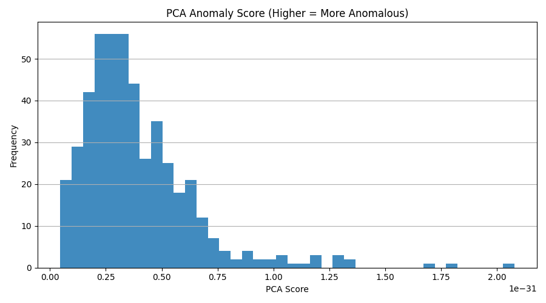
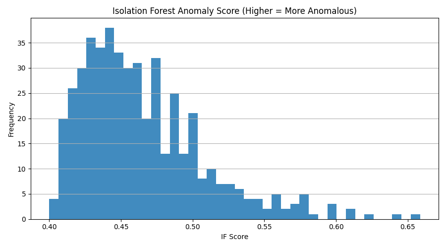
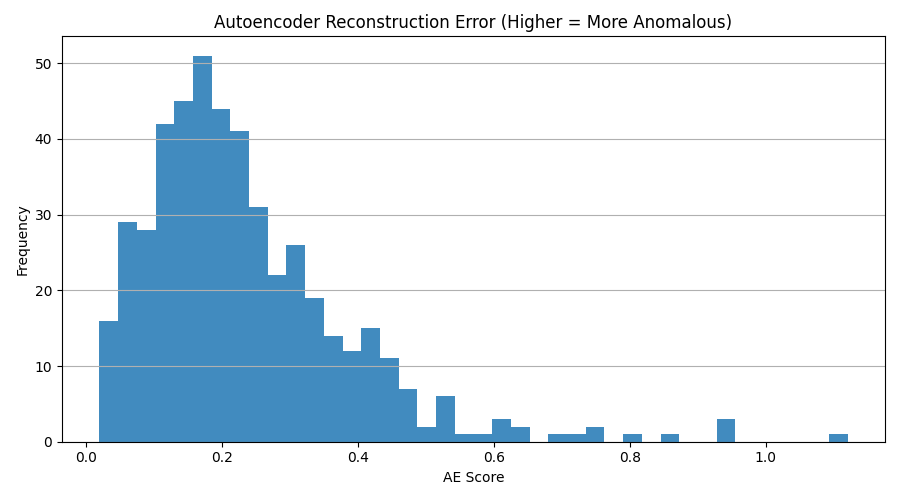
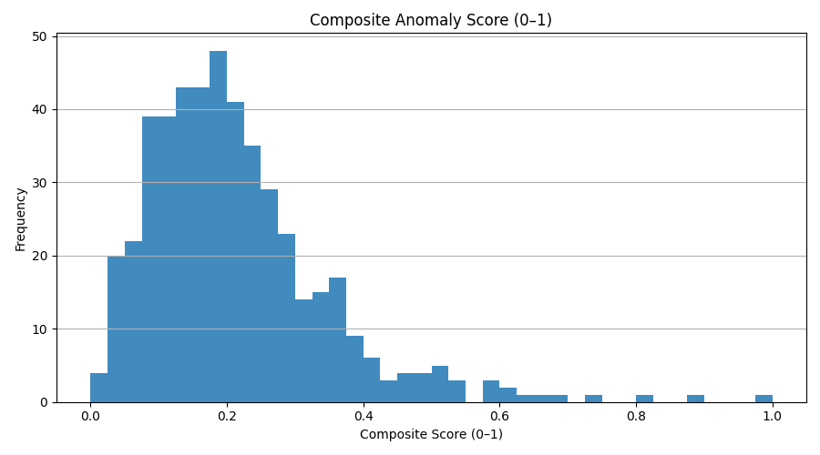
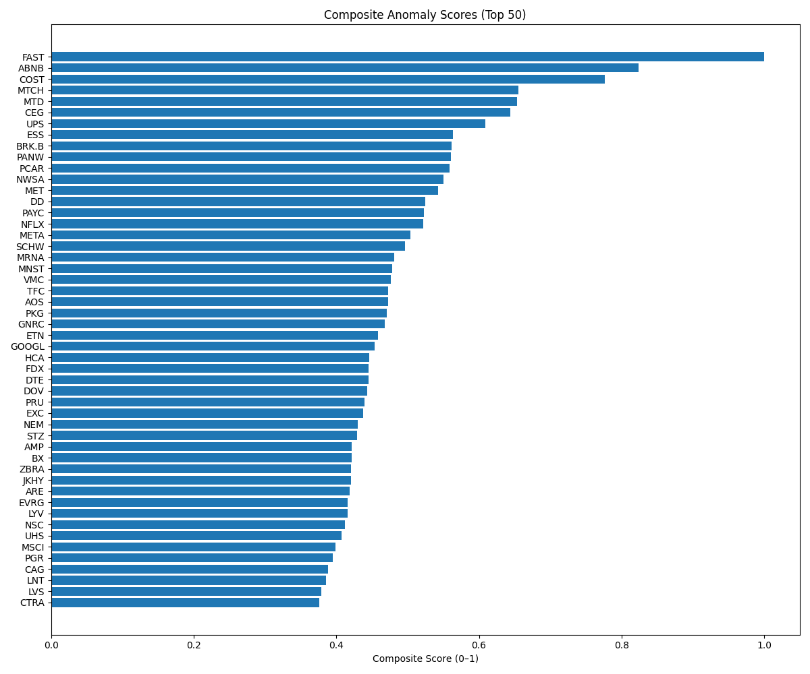
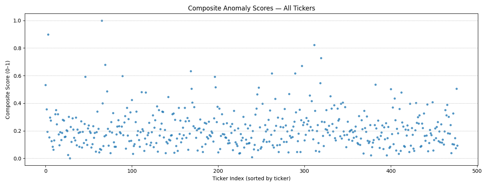
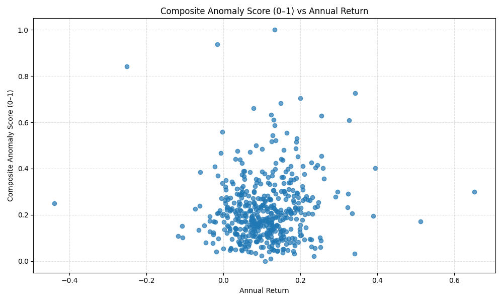

# Composite Anomaly Detection Report

## Summary Stats
```json
{
  "count": 478,
  "pca_mean": 0.1263175076990442,
  "if_mean": 0.4649435876576604,
  "ae_mean": 0.2355072891064871,
  "comp_mean_0to1": 0.22226552989460413
}
```

## PCA Distribution


## Isolation Forest Distribution


## Autoencoder Distribution


## Composite Distribution (0–1)


## Top Composite Anomalies


## All Composite Scores


## Composite Anomaly vs Annual Return


---
_Generated by run_anomaly_pipeline.py_
